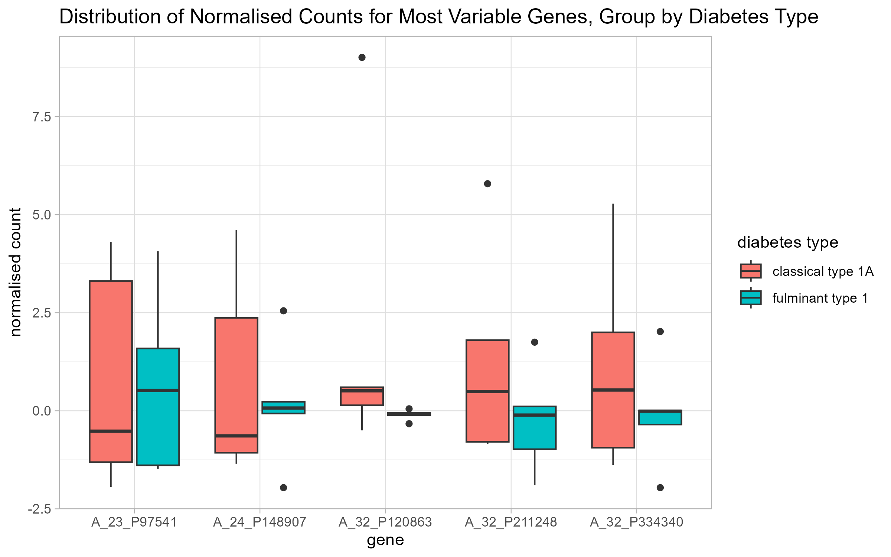

# Transcriptomic Data Analysis on Diabetes Dataset

## Introduction

The purpose of this repository is to perform a transcriptomic data analysis on the dataset from [Gene Expression Fulminant Type 1 Diabetes vs Classical Type 1A Diabetes](https://www.ncbi.nlm.nih.gov/geo/query/acc.cgi?acc=GSE44313) from the Gene Expression Omnibus (GEO). The dataset contains 10 samples and 41,000 genes. The goal of this analysis is to find any patterns or clusters and identify any features that may influence the observations.

## How to run code

If using RStudio, follow the below steps to run the code locally:

1.  Clone repository on your local device.
2.  Open the *omics-analysis.Rproj* to open the project in RStudio.
3.  Run `renv::restore()` on the RStudio console to restore the project library locally.
4.  Open the R scripts in the *scripts* subdirectory and run each script in the given order to reproduce the analysis.
